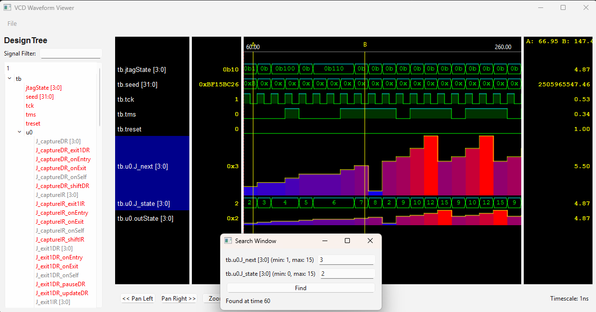

# WaveScout

**AI-generated VCD Waveform viewer using Python and PySide6.**



## Introduction

This pet project explores AI coding assistants, Python, and PySide. The initial version was fully generated by ChatGPT 
o3-mini over approximately six hours of conversation, with all 1,653 lines of code copy-pasted directly from the assistant. 
This description is also generated by the model.

Development started with a basic application, gradually adding features. However, as the project grew beyond ~1,500 
lines of code, the AI-generated code became less reliable, often introducing regressions. To address this, the next 
step is to modularize the application to improve maintainability and optimize prompt size for future enhancements.

## Prerequisites

- **Python 3.8+**
- **pip**

## Installation

1. **Clone the repository:**

   ```bash
   git clone https://github.com/ripopov/WaveScout
   cd WaveScout
   ```

2. **(Optional) Create and activate a virtual environment:**

   ```bash
   python -m venv venv
   # On Linux/macOS:
   source venv/bin/activate
   # On Windows:
   venv\Scripts\activate
   ```

3. **Install dependencies:**

   - Install PySide6 directly:

     ```bash
     pip install PySide6
     ```

   - Alternatively, install using the requirements file:

     ```bash
     pip install -r requirements.txt
     ```

## Running the Application

Run the main script with:

```bash
python wavescout.py
```

By default, the application attempts to load `jtag.vcd` from the repository root. 
You can open a different VCD file using the **File > Open...** menu option within the application.

---